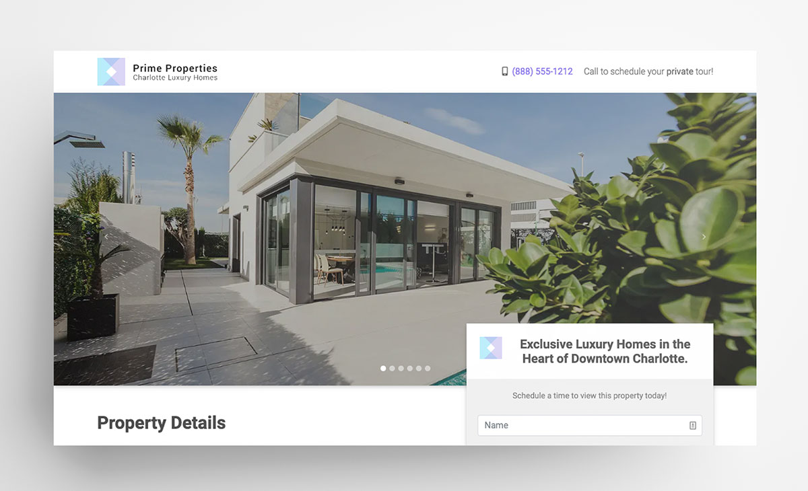

<!-- Status Badges -->

# Property Listing Page Template

A Simple single page website template built with Gatsby to display a single real estate property listing.

[View Demo](https://pp-lp312075.netlify.com/)

## Features

- React Image Lightbox
- Image Carousel
- Progressive Web App
- Material Design Bootstrap Components

<!-- Deploy to Netlify -->

